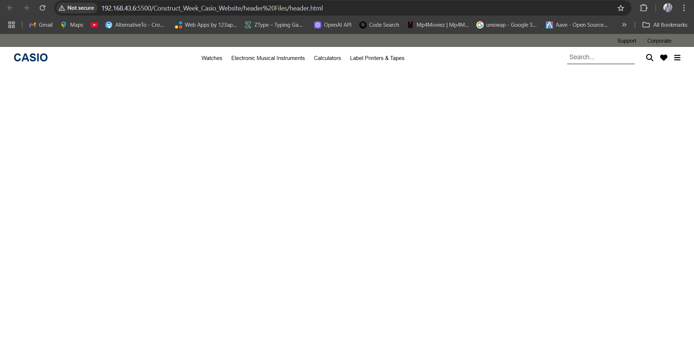
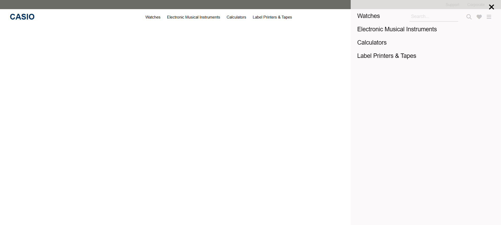
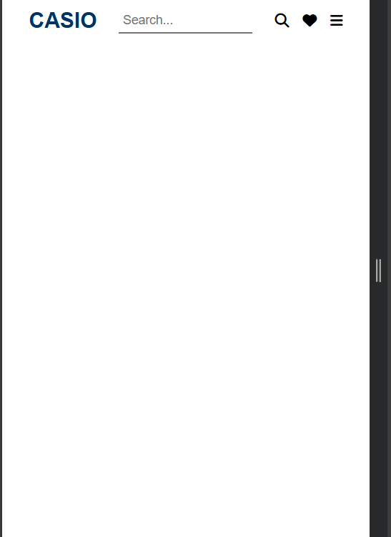

# Responsive Header

This project is a responsive header designed for a website, featuring a top section, a navigation bar, and a hamburger menu for smaller screens. The design is simple, elegant, and adjusts seamlessly for different screen sizes.

## Features

- **Top Section**: Includes links for support and corporate information.
- **Navigation Bar**: Displays the logo, navigation links, and action icons like search and favorites.
- **Responsive Design**:
  - On larger screens, the top section and navigation bar are visible.
  - On smaller screens, the hamburger menu replaces the navigation bar.
- **Search Box Interaction**:
  - Expands when focused.
  - Hides the navigation menu when in use and restores it when blurred.
- **Hamburger Menu**:
  - Opens and closes smoothly with animations.
  - Includes navigation links with hover effects.

## Technologies Used

- **HTML**: Structure of the header.
- **CSS**: Styling and responsiveness.
- **Font Awesome**: For icons.
- **JavaScript**: For interactive elements like the hamburger menu and search box.

## Usage

1. Clone the repository.
2. Open the `index.html` file in any modern browser to view the header.

## How It Works

1. The header is divided into three sections:
   - **Top Section**: Displays additional links like "Support" and "Corporate."
   - **Navigation Bar**: Contains the website logo, navigation links, and icons for search and favorites.
   - **Hamburger Menu**: Provides a collapsible menu for smaller screens.
2. **Responsive Design**: The layout adapts based on the screen width using CSS media queries.
3. **JavaScript Functionality**:
   - Toggles the hamburger menu visibility.
   - Expands the search box and hides the navigation bar when focused.

## File Structure

```
|-- index.html   # Main HTML file
|-- style.css    # Embedded CSS for styling
|-- script.js    # Embedded JavaScript for interactivity
```

## Screenshots

- **Desktop View**:





- **Mobile View**:
  

## Customization

- Modify the CSS variables to change colors, fonts, or spacing.
- Add or remove navigation links in the HTML structure.

## License

This project is open-source and available for modification and use in personal or commercial projects.
